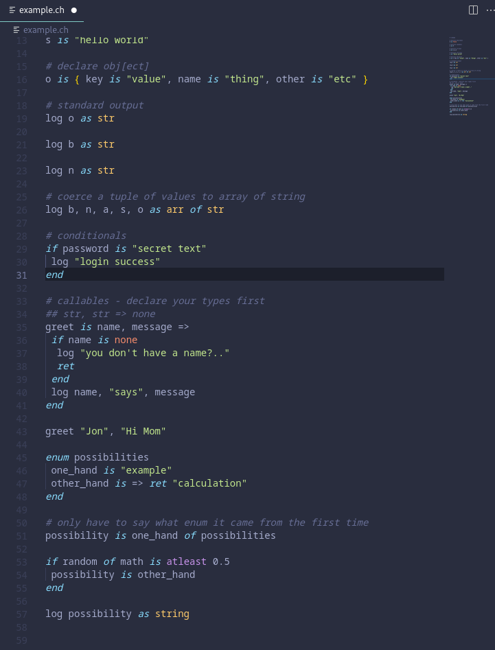

# cheedo

An attempt to make a language that is easy to read, easy to type on most keyboards, and hopefully compile to x86 assembly

Implemented:
- [lexer.ts](./src/lexer.ts) a simple, reprogrammable lexer
- [cheedo-vscode](https://github.com/RepComm/cheedo-vscode) a basic syntax highlighter for cheedo lang
